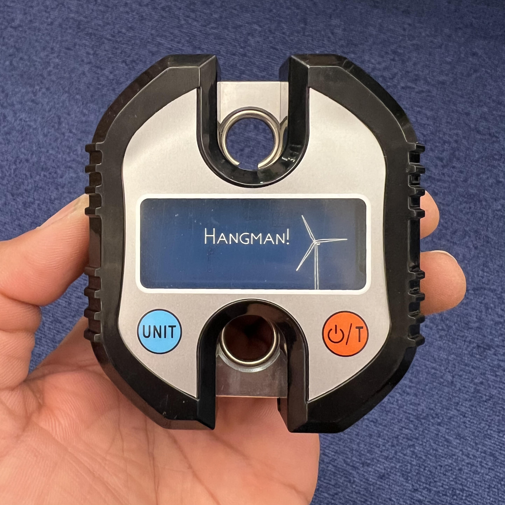
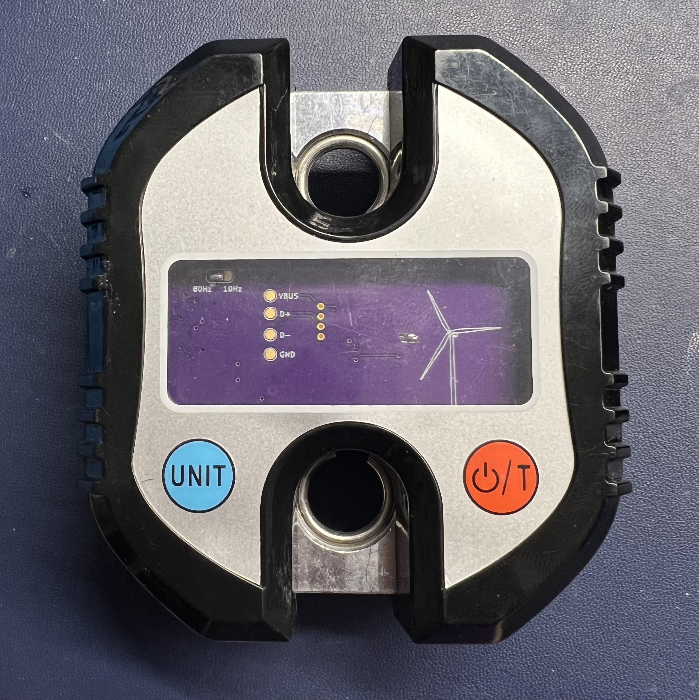

# hangman ⚖️

  

Hangman is a Bluetooth-enabled crane scale. It's intended use is as a climbing training and rehab
tool, but it can be used anywhere that requires measuring force or weight.

The hardware retrofits a cheap (~$23) 150kg crane scale from Amazon with a custom PCB based around a
Nordic nRF52 microcontroller and a differential ADC. The firmware uses [Embassy][Embassy], an
embedded async framework written in Rust, as well as Nordic's SoftDevice Bluetooth stack.

## Why?

Crane scales have become popular in the climbing community as a means to train and rehab fingers.
This is a fun project to learn and practice various concepts I was unfamiliar or rusty with: BLE
101, async Rust on embedded, nRF52 development, SMT soldering and PCB design, etc. Maybe it'll even
help my fingers get stronger.

## Status

The scale is feature-complete. Weight measurement works great with the [Progressor API][API] and
compatible tools. Battery life is guesstimated to be in the range of several months to a couple of
years depending on usage.

There are still a few more software updates planned. See the Issues section for the major ones.

### Hardware revisions

#### P1.0

See title picture. A custom PCB based on a Fanstel BT832 nRF52832-based module and a Texas
Instruments ADS1230 ADC. Thanks to a better ADC and PCB layout, noise performance should be improved
over previous revisions and most importantly, it's much prettier.

#### P0.0

A custom PCB based on a nRF52840 USB dongle and an HX711 ADC, the same differential ADC used on the
Tindeq.

  

## Shoutouts

* The [Embassy](https://embassy.dev) project for bringing asynchronous Rust to the embedded world.
  and creating an easy to use wrapper around the Nordic SoftDevice Bluetooth stack.
* [Bumble](https://github.com/google/bumble) for BLE testing and prototyping.
* Texas Instruments for their excellent reference materials on load cell circuit design and PCB
  layout.
* [Tindeq](https://tindeq.com/product/progressor/) for making an amazing product and app and opening
  their BLE API to third-party developers. Go buy one!

## Disclaimer

This is not an officially supported Google product. Wouldn't that be funny though?

This has no affiliation with Tindeq.

[API]: https://tindeq.com/progressor_api/
[Embassy]: https://embassy.dev/
