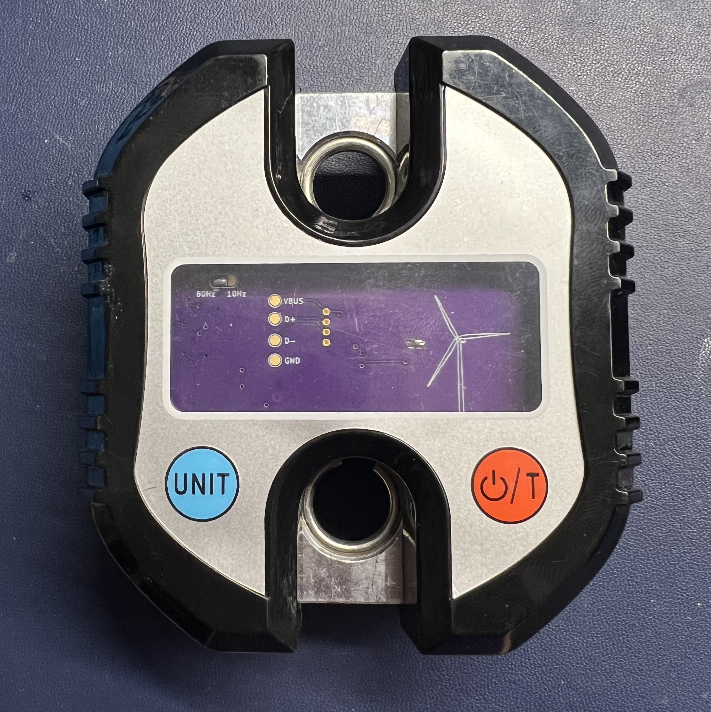

# hangman ⚖️

  

A Bluetooth-enabled crane scale and training tool compatible with the custom [Tindeq Progressor
Bluetooth service][API], which allows it to be used with compatible tools.

The hardware retrofits a cheap (~$22) crane scale from Amazon with a custom PCB based around a
Nordic nRF52 microcontroller and a differential ADC. The firmware uses [Embassy][Embassy], an
embedded async framework written in Rust, and Nordic's Bluetooth stack.

This is primarily a fun project to learn and practice various concepts I was unfamiliar or rusty
with: BLE 101, async Rust on embedded, nRF52 development, SMT soldering and PCB design, etc. Maybe
it'll even help my fingers get stronger.

## Status

Weight measurement works great with the Tindeq mobile app, and battery life is guesstimated to be
in the range of several months to a couple years. But I still have a few more things planned:

* Another PCB revision
* Battery voltage sampling and low battery shutdown
* Calibration over Bluetooth
* More documentation for anyone wants to follow in my footsteps
* Miscellaneous code cleanup and polish

### Hardware revisions

#### P0.0

Based on a nRF52840 USB dongle and an HX711 ADC. See title picture.

#### P1.0

WIP. Based on a Fanstel BT832 (nRF52832) and a TI ADS1230 ADC. Should be a little prettier and less
noisy 🤞

## Shoutouts

* The [Embassy](https://embassy.dev) project for bringing asynchronous Rust to the embedded world.
  and creating an easy to use wrapper around the Nordic SoftDevice Bluetooth stack.
* [Bumble](https://github.com/google/bumble) for BLE testing and prototyping.
* Texas Instruments for their excellent reference materials on load cell circuit design and PCB
  layout.
* [Tindeq](https://tindeq.com/product/progressor/) for making an amazing product and app and opening
  their BLE API to third-party developers. Go buy one!

## Disclaimer

This is not an officially supported Google product. Wouldn't that be funny though?

This has no affiliation with Tindeq.

[API]: https://tindeq.com/progressor_api/
[Embassy]: https://embassy.dev/
