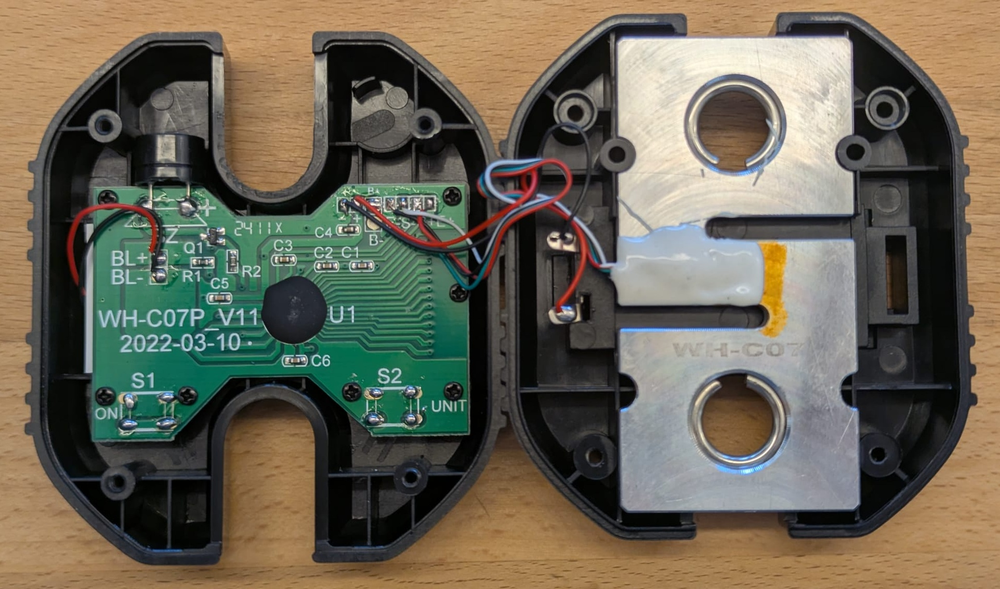
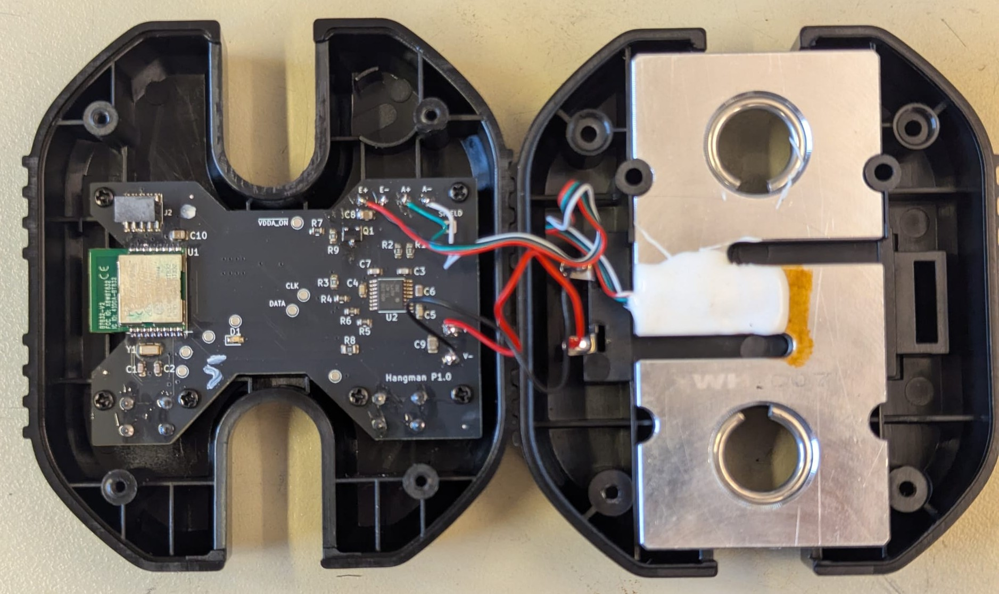

# Assembly

How to assemble the boards into the housings

## Instructions
- Test the scale to make sure that it generally works
- Disassemble fully, keep the screws

  

- Swap over the wires to the new, already populated PCB
- Screw the new PCB back in 

  

- Measure the voltage input pins for shorts (to prevent stupid errors)
- Power on the board with batteries or a lab bench power supply
- Do the [Bringup](./bringup.md)
- Close the housing and screw it shut, don't pinch any wires or strip any screws 
- Do the [Calibration](./calibration.md)
- Done!